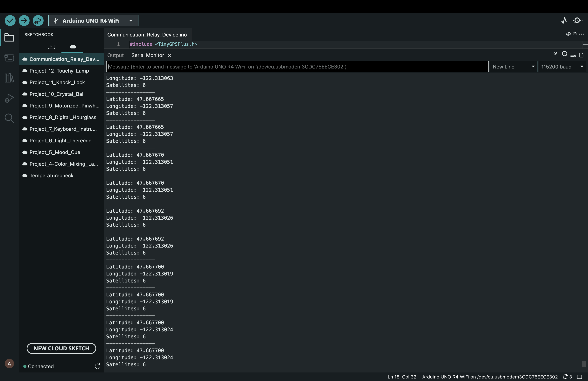
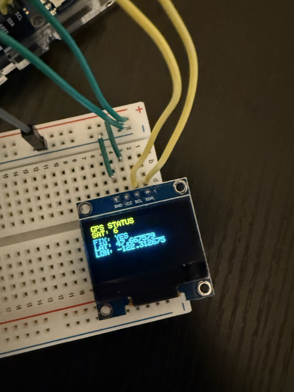

# Portable Emergency Communication Relay Network

A battery-powered embedded communication system designed to provide GPS location tracking and emergency messaging in environments without cellular or internet infrastructure.

## Status

-Milestone 1 Complete
-Milestone 2 Complete
-Milestone 3 Complete
Current Milestone 4

## Progress

- [x] GPS module integration
- [x] UART communication verified
- [x] GPS fix acquired (6 satellites)
- [x] OLED display integration
- [x] GPS coordinates on OLED
- [x] LoRa module verification
- [ ] LoRa communication
- [ ] Multi-hop relay network
- [ ] Battery-powered deployment

## Project Goal

Build a portable emergency communication system using an Arduino UNO R4 WiFi, GPS module, OLED display, and future LoRa radio modules. The first milestone is to read live GPS coordinates and display them on an OLED screen.

## Current Milestone

Current Task: Milestone 4 (LoRa Communication)

## Planned Features

- GPS location tracking
- OLED status display
- Emergency SOS message generation
- LoRa wireless communication
- Multi-hop relay forwarding
- Base station dashboard

## Hardware

Current:

Arduino UNO R4 WiFi
NEO-6M GPS Module
SSD1306 0.96 inch I2C OLED Display
RYLR998 LoRa Module

Future:

Additional RYLR998 LoRa Modules
STM32 Nucleo Development Board
Battery packs
Enclosures

## Repository Structure

- `/docs` — project plan, BOM, and notes
- `/hardware` — wiring notes and diagrams
- `/software` — Arduino code for each milestone
- `/images` — project photos and screenshots

## Milestones

1. GPS test using Serial Monitor
2. OLED test display
3. GPS data displayed on OLED
4. LoRa message transmission
5. Three-node relay network
6. Battery-powered final prototype

## Milestone 1 - GPS Integration

### Objective
Integrate the NEO-6M GPS module with the Arduino UNO R4 WiFi and verify location tracking.

### Results
- GPS communication established using UART
- TinyGPSPlus successfully decoded NMEA messages
- GPS fix acquired with 6 satellites
- Real-time latitude and longitude displayed in Serial Monitor

### Example Output

Latitude: 47.667700
Longitude: -122.313024
Satellites: 6

### Evidence

## Milestone 2 - OLED Display Integration

### Objective
Integrate the SSD1306 OLED display with the Arduino UNO R4 WiFi and verify display functionality.

### Results
- OLED display successfully initialized
- I2C communication established using SDA and SCL
- Text successfully displayed on OLED screen
- Adafruit SSD1306 and GFX libraries integrated successfully

### Example Output

HELLO

### Evidence

## Milestone 3 - GPS and OLED Integration

### Objective
Integrate the NEO-6M GPS module and SSD1306 OLED display into a standalone embedded system.

### Results
- GPS data successfully displayed on OLED screen
- Real-time latitude and longitude updates verified
- Satellite count displayed on OLED
- GPS fix status displayed on OLED
- Standalone operation achieved without Serial Monitor

### Example Output
GPS STATUS
SAT: 6
FIX: YES
LAT: 47.xxxxxx
LON: -122.xxxxxx

### Evidence

## Milestone 4 Preparation - LoRa Module Verification

### Objective

Integrate the RYLR998 LoRa module with the Arduino UNO R4 WiFi and verify UART communication using AT commands.

### Results

- Successfully connected RYLR998 to the Arduino UNO R4 WiFi
- Verified UART communication using Serial1
- Confirmed module address configuration
- Confirmed network ID configuration
- Confirmed operation on the 915 MHz frequency band
- Verified baud rate configuration

### Evidence

#### LoRa Module Verification

The RYLR998 LoRa module successfully responded to multiple AT commands. The module address, network ID, operating frequency, and baud rate were verified, confirming successful UART communication between the Arduino UNO R4 WiFi and the LoRa transceiver.

Verified Output:

+OK

+ADDRESS=0

+NETWORKID=18

+BAND=915000000

+IPR=115200

+PARAMETER=9,7,1,12
