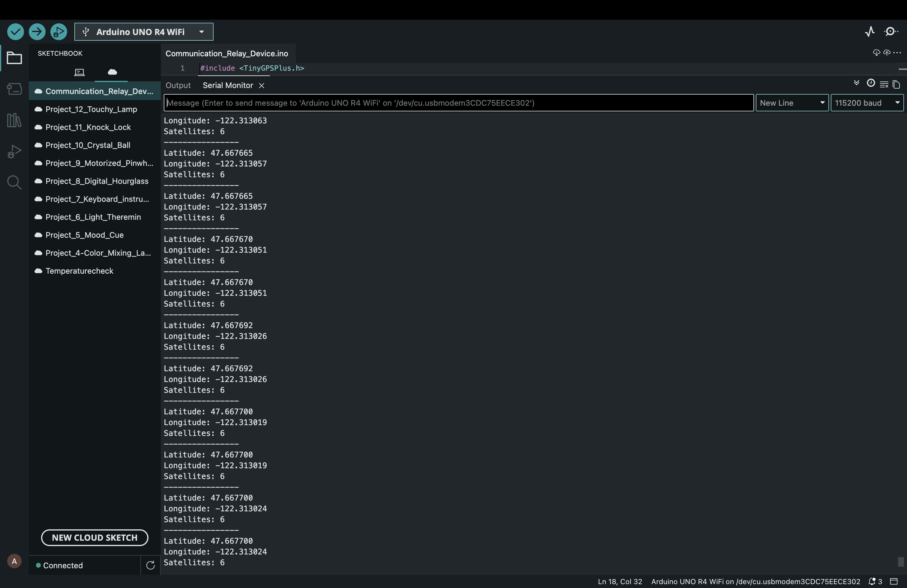
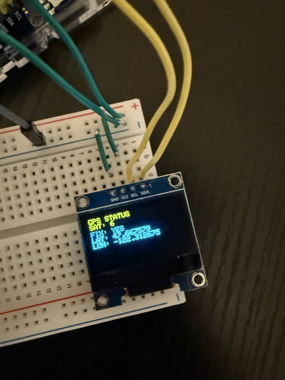
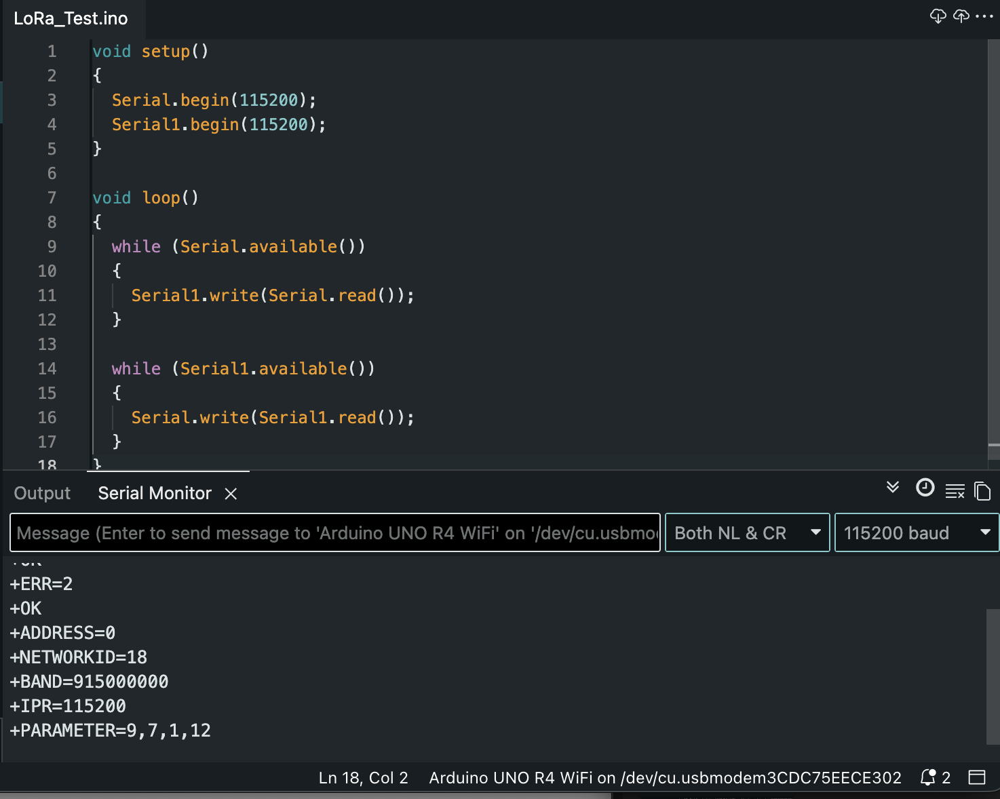
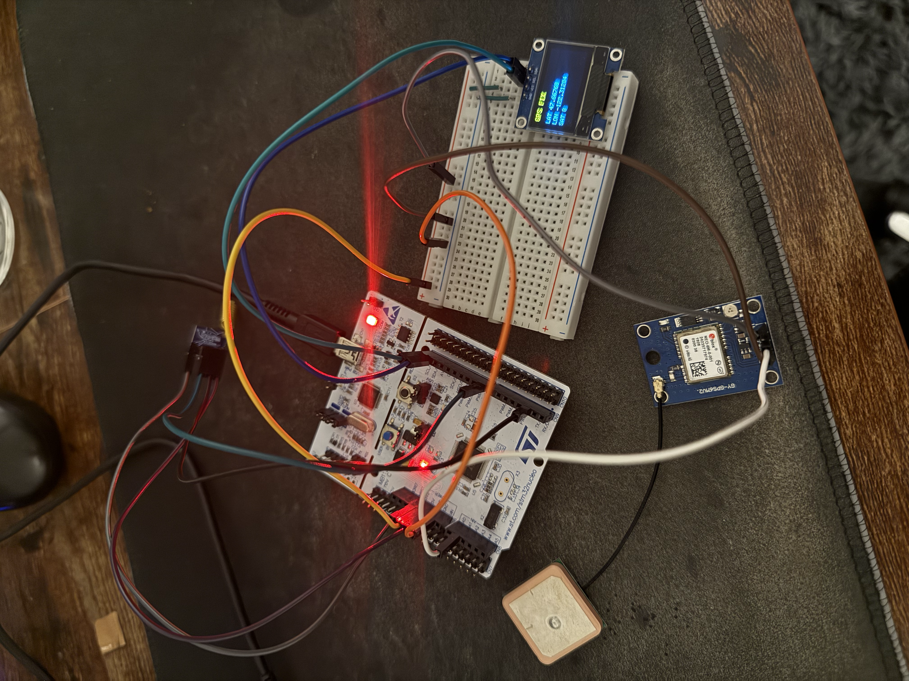
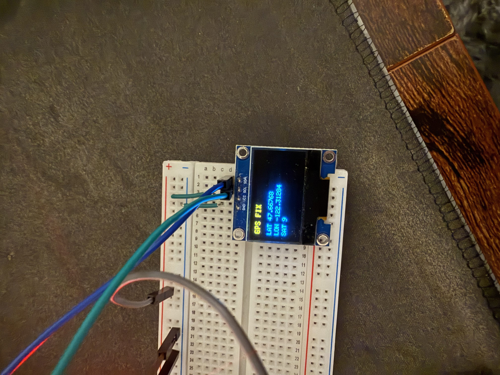
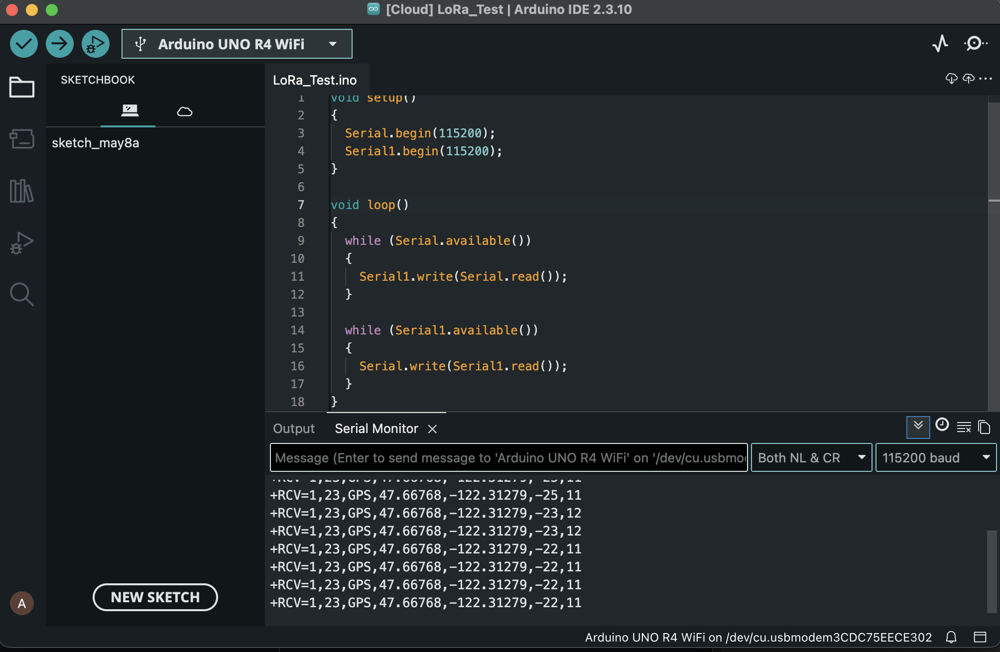
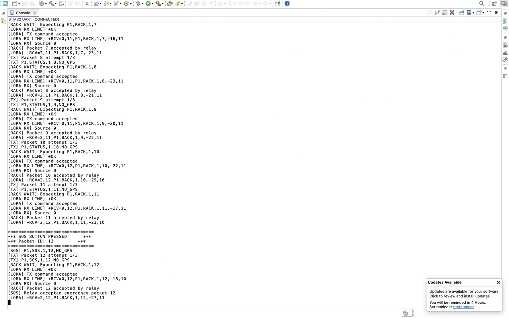
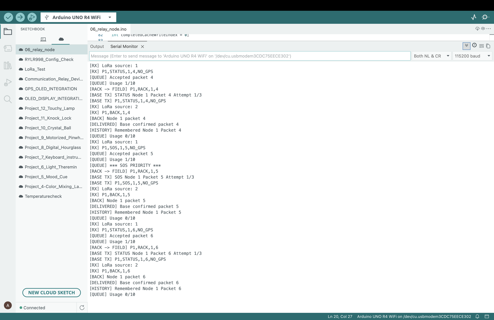
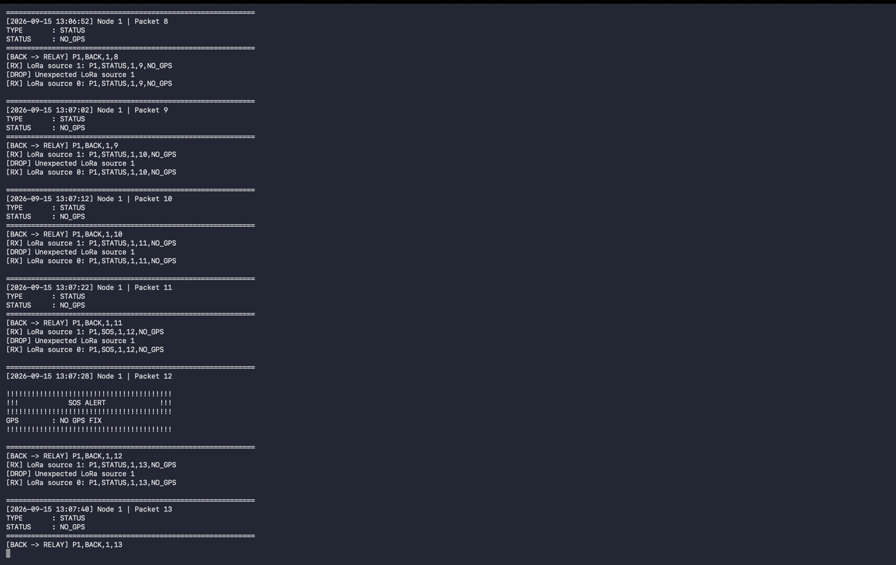

# Portable Emergency Communication Relay Network

A portable embedded communication system designed to provide GPS location tracking and emergency messaging in environments without cellular or internet infrastructure.

PECRN uses an STM32 field unit, LoRa wireless communication, an Arduino relay node, and a PC-based base station to reliably deliver GPS telemetry, system status, and emergency SOS messages.

## Status

- Milestone 1 Complete
- Milestone 2 Complete
- Milestone 3 Complete
- Milestone 4 Complete
- Milestone 5 Complete
- Current Milestone: 6 - Portable Deployment and System Testing

# Progress

- [x] GPS module integration
- [x] UART communication verified
- [x] GPS fix acquired
- [x] OLED display integration
- [x] GPS coordinates displayed on OLED
- [x] LoRa module verification
- [x] STM32 ↔ RYLR998 UART communication
- [x] Point-to-point LoRa communication
- [x] STM32 field unit → Arduino receiver wireless transmission
- [x] Bidirectional LoRa communication
- [x] GPS coordinate transmission over LoRa
- [x] Three-node relay network
- [x] Field → Relay → Base communication
- [x] PECRN Protocol V1
- [x] Packet identification
- [x] Field → Relay acknowledgements
- [x] Relay → Base acknowledgements
- [x] Automatic retransmission
- [x] Relay packet queue
- [x] Duplicate packet detection
- [x] FIFO telemetry forwarding
- [x] SOS priority
- [x] Emergency SOS messages
- [x] GPS validation and last-known position
- [x] PC-based base station
- [ ] Battery-powered deployment
- [ ] Range and reliability testing
- [ ] Portable enclosure

## Project Goal

Build a portable emergency communication network capable of transmitting GPS coordinates and emergency SOS messages in environments without cellular or internet infrastructure.

The current prototype uses a GPS-enabled STM32 field node, an Arduino LoRa relay, and a PC-based base station.

The system implements reliable packet delivery using acknowledgements, retransmission, packet buffering, duplicate detection, and emergency-message prioritization.

## Documentation

- Project Plan: `docs/project_plan.md`
- System Architecture: `docs/system_architecture.md`

## Current System

```text
STM32 FIELD UNIT
LoRa Address 1
GPS + OLED + SOS
       │
       │ GPS / STATUS / SOS
       ▼
ARDUINO RELAY
LoRa Address 0
       │
       │ Forwarded Packet
       ▼
BASE STATION
LoRa Address 2
       │
       ▼
Python PC Interface
```

## Planned Features

- [x] GPS location tracking
- [x] OLED status display
- [x] Emergency SOS message generation
- [x] LoRa wireless communication
- [x] Relay forwarding
- [x] PC-based base station
- [x] Reliable acknowledgement protocol
- [x] Duplicate protection
- [ ] Battery-powered field operation
- [ ] Portable enclosure
- [ ] Extended range testing

## Hardware

### Current

- Arduino UNO R4 WiFi
- STM32 NUCLEO-F446RE
- NEO-6M GPS Module
- SSD1306 0.96 inch I2C OLED Display
- RYLR998 LoRa Modules (3)
- CP2102 USB-to-UART Adapter
- PC / macOS Base Station

### Future

- Battery Packs
- Enclosures

## Repository Structure

```text
/docs       — project plan, BOM, architecture, and notes
/hardware   — wiring notes and diagrams
/software   — embedded firmware and base station software
/images     — project photos and screenshots
```

---

# Milestone 1 - GPS Integration

## Objective

Integrate the NEO-6M GPS module with the Arduino UNO R4 WiFi and verify location tracking.

## Results

- GPS communication established using UART
- TinyGPSPlus successfully decoded NMEA messages
- GPS fix successfully acquired
- Real-time latitude and longitude displayed in Serial Monitor

## Example Output

```text
Latitude: 47.667700
Longitude: -122.313024
Satellites: 6
```

## Evidence



---

# Milestone 2 - OLED Display Integration

## Objective

Integrate the SSD1306 OLED display with the Arduino UNO R4 WiFi and verify display functionality.

## Results

- OLED display successfully initialized
- I2C communication established using SDA and SCL
- Text successfully displayed on OLED screen
- Adafruit SSD1306 and GFX libraries integrated successfully

## Example Output

```text
HELLO
```

## Evidence


---

# Milestone 3 - GPS and OLED Integration

## Objective

Integrate the NEO-6M GPS module and SSD1306 OLED display into a standalone embedded system.

## Results

- GPS data successfully displayed on OLED screen
- Real-time latitude and longitude updates verified
- Satellite count displayed on OLED
- GPS fix status displayed on OLED
- Standalone operation achieved without Serial Monitor

## Example Output

```text
GPS STATUS
SAT: 6
FIX: YES
LAT: 47.xxxxxx
LON: -122.xxxxxx
```

## Evidence



---

# Milestone 4 - LoRa Communication and STM32 Field Unit

## Objective

Develop an STM32-based field unit capable of acquiring GPS coordinates, displaying location information locally, and transmitting the coordinates wirelessly using RYLR998 LoRa transceivers.

The field unit uses the STM32 NUCLEO-F446RE as the primary microcontroller and communicates with the GPS, OLED display, and LoRa transceiver through multiple embedded communication interfaces.

## Results

- Successfully connected the RYLR998 LoRa module to the STM32 NUCLEO-F446RE
- Verified UART communication between the STM32 and RYLR998
- Configured RYLR998 modules for point-to-point LoRa communication
- Integrated the NEO-6M GPS module with the STM32
- Received NMEA GPS sentences through UART
- Parsed GPS latitude, longitude, fix status, and satellite count on the STM32
- Integrated the SSD1306 OLED display using I2C
- Displayed live GPS information on the OLED
- Formatted GPS coordinates into LoRa data packets
- Successfully transmitted live GPS coordinates from the STM32 field unit
- Successfully received LoRa GPS packets on an Arduino UNO R4 WiFi receiving node
- Verified continuous wireless GPS coordinate updates

## Field Unit Architecture

```text
NEO-6M GPS
     │
     │ UART4
     ▼
STM32 NUCLEO-F446RE
     │
     ├──── I2C1 ────► SSD1306 OLED
     │
     └──── USART1 ──► RYLR998 LoRa
                           │
                           │ Wireless LoRa
                           ▼
                      RYLR998 LoRa
                           │
                           ▼
                   Arduino UNO R4 WiFi
```

## Communication Interfaces

- **UART4** — NEO-6M GPS communication at 9600 baud
- **I2C1** — SSD1306 OLED communication at 100 kHz
- **USART1** — RYLR998 LoRa communication at 115200 baud
- **USART2** — debugging / PC serial communication at 115200 baud

## GPS Processing

The NEO-6M sends standard NMEA GPS sentences to the STM32.

The firmware identifies GGA sentences and extracts:

- Latitude
- Longitude
- GPS fix status
- Satellite count

The NMEA coordinates are converted from degrees/minutes format into decimal degrees before transmission.

Example processed coordinates:

```text
Latitude: 47.66768
Longitude: -122.31279
```

## OLED Display

After acquiring a valid GPS fix, the STM32 displays the current position and satellite information on the SSD1306 OLED.

Example:

```text
GPS FIX

LAT 47.66768
LON -122.31284
SAT 9
```

## LoRa Packet Format

During Milestone 4, the STM32 transmitted basic GPS payloads such as:

```text
GPS,47.66768,-122.31279
```

These basic packets were later replaced by the structured PECRN Protocol V1 format implemented during Milestone 5.

## Example Received Data

```text
+RCV=1,23,GPS,47.66768,-122.31279,-25,11
+RCV=1,23,GPS,47.66768,-122.31279,-23,12
+RCV=1,23,GPS,47.66768,-122.31279,-23,12
+RCV=1,23,GPS,47.66768,-122.31279,-22,11
+RCV=1,23,GPS,47.66768,-122.31279,-22,11
```

## Milestone 4 Evidence

### LoRa Module Verification



The RYLR998 LoRa module successfully responded to AT commands during initial testing.

Verified configuration included:

```text
+OK
+ADDRESS=0
+NETWORKID=18
+BAND=915000000
+IPR=115200
+PARAMETER=9,7,1,12
```

### STM32 Field Unit Prototype



The STM32 NUCLEO-F446RE field unit integrates the NEO-6M GPS module, SSD1306 OLED display, and RYLR998 LoRa transceiver.

### Live GPS Display



The SSD1306 OLED displays live GPS information processed by the STM32, including GPS fix status, latitude, longitude, and satellite count.

### Wireless GPS Reception



Live GPS coordinates transmitted by the STM32 field unit were successfully received wirelessly by the Arduino UNO R4 WiFi receiving node through a second RYLR998 LoRa module.

## Milestone 4 Outcome

Milestone 4 established the initial embedded wireless communication path and provided the foundation for the complete three-node relay architecture implemented in Milestone 5.

---

# Milestone 5 - Three-Node Reliable Relay Network

## Objective

Extend the point-to-point LoRa system into a three-node communication network capable of reliably forwarding GPS telemetry, status information, and emergency SOS messages through an intermediate relay to a PC-based base station.

## Final Architecture

```text
FIELD NODE
STM32 NUCLEO-F446RE
LoRa Address 1
GPS + OLED + SOS
        │
        │ GPS / STATUS / SOS
        ▼
RELAY NODE
Arduino UNO R4 WiFi
LoRa Address 0
        │
        │ Forwarded Packet
        ▼
BASE STATION
RYLR998
LoRa Address 2
        │
        ▼
Python Base Station
```

## PECRN Protocol V1

Milestone 5 introduces a structured application-layer packet format:

```text
P1,<TYPE>,<NODE_ID>,<PACKET_ID>,<DATA...>
```

Supported packet types include:

```text
GPS
STATUS
SOS
RACK
BACK
```

### GPS

```text
P1,GPS,1,<packetID>,<latitude>,<longitude>,<satellites>
```

Example:

```text
P1,GPS,1,286,47.66769,-122.31281,6
```

### STATUS

```text
P1,STATUS,1,<packetID>,GPS_FIX,<satellites>
```

Example:

```text
P1,STATUS,1,285,GPS_FIX,6
```

Other status conditions include:

```text
GPS_LOST
NO_GPS
```

### SOS

The field unit can generate an emergency SOS packet containing:

- Current GPS position when a valid fix exists
- Last-known GPS position when the current fix has been lost
- `NO_GPS` when no valid position is available

---

# Reliable Packet Delivery

Milestone 5 implements acknowledgement-based delivery on both wireless stages.

## Field → Relay

```text
FIELD                               RELAY

  │                                   │
  │ GPS / STATUS / SOS                │
  ├──────────────────────────────────►│
  │                                   │
  │       P1,RACK,1,<packetID>        │
  │◄──────────────────────────────────┤
  │                                   │
```

`RACK` confirms that the Relay has accepted and stored the Field packet.

If the expected acknowledgement is not received, the Field Unit automatically retries the packet.

Current Field configuration:

```text
RACK timeout     = 2000 ms
Maximum attempts = 3
Retry delay      = 100 ms
```

USART1 reception on the STM32 uses interrupt-driven UART reception with a software ring buffer so incoming RYLR998 responses can be captured reliably.

---

## Relay → Base

```text
RELAY                                BASE

  │                                   │
  │ GPS / STATUS / SOS                │
  ├──────────────────────────────────►│
  │                                   │
  │       P1,BACK,1,<packetID>        │
  │◄──────────────────────────────────┤
  │                                   │
```

`BACK` confirms successful delivery to the Base Station.

Current Relay configuration:

```text
BACK timeout      = 2000 ms
Maximum attempts  = 3
Retry backoff     = 5000 ms
Queue size        = 10 packets
Completed history = 32 packets
```

Packets that do not receive `BACK` remain stored for later retry.

---

# Relay Queue

The Arduino Relay implements a 10-packet software queue.

Normal telemetry uses strict FIFO ordering:

```text
Oldest STATUS/GPS
        │
        ▼
      Base
```

SOS packets receive priority:

```text
Normal Packet
Normal Packet
SOS Packet       ← PRIORITY
Normal Packet
```

The Relay also implements a quiet period after Field traffic so Field ↔ Relay acknowledgement traffic is given priority before Relay → Base transmission begins.

---

# Duplicate Protection

Each application packet contains a packet ID.

The Relay checks incoming packets against:

1. Packets currently stored in the active queue
2. Recently completed packets

If a duplicate exists in the active queue, the Relay sends `RACK` again without storing another copy.

If the packet has already been delivered to the Base Station, the Relay also sends `RACK` again without forwarding the packet.

This protects the system against duplicate delivery when an acknowledgement is lost.

---

# SOS Emergency Messaging

The STM32 field unit uses the NUCLEO B1 / PC13 button as the emergency input.

The button is handled using an external interrupt and software debounce.

SOS messages receive transmission priority over ordinary GPS and STATUS telemetry.

Depending on GPS state, the Field Unit transmits:

```text
CURRENT GPS POSITION
```

or:

```text
LAST KNOWN GPS POSITION
```

or:

```text
NO_GPS
```

The OLED also displays emergency transmission status locally.

---

# Base Station

The Base Station runs Python on a PC connected to an RYLR998 through a CP2102 USB-to-UART adapter.

The Base Station:

- Receives packets from the Relay
- Rejects direct Field transmissions
- Parses Protocol V1
- Displays packet IDs
- Displays STATUS information
- Displays GPS coordinates
- Displays satellite count
- Processes SOS messages
- Returns `BACK` acknowledgements

Example received STATUS packet:

```text
============================================================
Node 1 | Packet 285
TYPE       : STATUS
STATUS     : GPS_FIX
SATELLITES : 6
============================================================
```

Example received GPS packet:

```text
============================================================
Node 1 | Packet 286
TYPE       : GPS
LATITUDE   : 47.66769
LONGITUDE  : -122.31281
SATELLITES : 6
============================================================
```

After processing the packet, the Base Station responds:

```text
P1,BACK,1,286
```

---

# Milestone 5 Verification

The complete three-node communication path has been successfully demonstrated:

```text
NEO-6M GPS
     │
     ▼
STM32 FIELD NODE
     │
     │ GPS / STATUS / SOS
     ▼
RYLR998
     │
     │ LoRa
     ▼
ARDUINO RELAY
     │
     │ Queue + Duplicate Detection
     │
     │ RACK ─────────────► Field
     │
     │ Forward
     ▼
RYLR998 BASE
     │
     ▼
PYTHON BASE STATION
     │
     │ BACK
     ▼
ARDUINO RELAY
```

During testing, consecutive GPS and STATUS packets were successfully forwarded through the Relay and acknowledged by the Base Station.

Example:

```text
P1,STATUS,1,285,GPS_FIX,6
P1,GPS,1,286,47.66769,-122.31281,6
P1,GPS,1,287,47.66768,-122.31283,6
P1,STATUS,1,288,GPS_FIX,6
P1,GPS,1,289,47.66769,-122.31283,6
```

For each forwarded packet, the Base Station returned the corresponding `BACK`.

---

# Milestone 5 Evidence

The following images document the complete three-node prototype and the Protocol V1 communication observed at each stage of the network.

## Three-Node Hardware Prototype


The complete PECRN Milestone 5 prototype consists of the STM32 field unit, Arduino UNO R4 relay node, and PC-based base station. Three RYLR998 LoRa transceivers provide the wireless links between the nodes.

The laptop runs the Python base-station interface through a CP2102 USB-to-UART adapter connected to the base-station RYLR998.

### STM32 Field Node Protocol



The STM32CubeIDE debug console shows Protocol V1 operation from the field node. Packets are assigned unique packet IDs and transmitted to the relay while the field node waits for the corresponding `RACK`.

The screenshot also demonstrates emergency SOS generation. Packet 12 is generated as:

```text
P1,SOS,1,12,NO_GPS
```

The relay responds with:

```text
P1,RACK,1,12
```

confirming that the emergency packet was accepted.

### Arduino Relay Protocol



The Arduino Serial Monitor demonstrates the intermediate relay operation. Incoming Field packets are accepted into the software queue, acknowledged with `RACK`, and forwarded toward the Base Station.

The screenshot also demonstrates:

- Relay queue operation
- Field packet acknowledgement
- Base Station forwarding
- `BACK` acknowledgement reception
- Completed-packet history
- SOS priority

For the SOS packet, the Relay identifies the emergency traffic and prioritizes it:

```text
[QUEUE] *** SOS PRIORITY ***
```

After forwarding the packet, the Base Station returns the corresponding `BACK`, confirming successful end-to-end delivery.

### PC Base Station SOS Reception



The Python Base Station terminal demonstrates the final stage of the communication path.

The Base Station accepts packets forwarded by LoRa address `0` and rejects packets received directly from Field address `1`. This ensures that the tested application path follows the intended:

```text
Field → Relay → Base
```

topology.

The screenshot also demonstrates reception of emergency packet 12 and displays an SOS alert with:

```text
GPS : NO GPS FIX
```

The Base Station then returns:

```text
P1,BACK,1,12
```

to the Relay.

Together, these four images demonstrate the physical prototype and successful application-layer communication across all three PECRN nodes.

---

## Milestone 5 Results

- [x] Third RYLR998 configured
- [x] Unique LoRa addresses assigned
- [x] PECRN Protocol V1 defined
- [x] Field packet IDs implemented
- [x] Relay packet reception implemented
- [x] Relay packet forwarding implemented
- [x] Field → Relay RACK acknowledgement implemented
- [x] Relay → Base BACK acknowledgement implemented
- [x] Field retransmission implemented
- [x] Relay retransmission implemented
- [x] Retry backoff implemented
- [x] 10-packet Relay queue implemented
- [x] FIFO telemetry forwarding implemented
- [x] SOS priority implemented
- [x] Active duplicate detection implemented
- [x] Completed packet history implemented
- [x] Queue-full protection implemented
- [x] GPS coordinate forwarding verified
- [x] STATUS forwarding verified
- [x] PC Base Station implemented
- [x] Complete Field → Relay → Base path verified
- [x] Emergency SOS packet generation implemented

## Milestone 5 Outcome

Milestone 5 transforms PECRN from a point-to-point LoRa demonstration into a functional three-node emergency communication prototype.

The system can now acquire real-world GPS data, display it locally, generate structured telemetry and emergency messages, reliably transfer those packets to an intermediate relay, buffer and forward them, detect duplicates, prioritize SOS traffic, and deliver the information to a PC-based Base Station.

---

# Current System Architecture

```text
                     PECRN

              ┌────────────────┐
              │   NEO-6M GPS   │
              └───────┬────────┘
                      │
                      ▼
              ┌────────────────┐
              │  STM32 FIELD   │
              │   Address 1    │
              │                │
              │ GPS Processing │
              │ OLED           │
              │ SOS            │
              └───────┬────────┘
                      │
                      │ LoRa
                      ▼
              ┌────────────────┐
              │ ARDUINO RELAY  │
              │   Address 0    │
              │                │
              │ Queue          │
              │ Retry          │
              │ Duplicates     │
              │ SOS Priority   │
              └───────┬────────┘
                      │
                      │ LoRa
                      ▼
              ┌────────────────┐
              │  BASE STATION  │
              │   Address 2    │
              │                │
              │ Python Parser  │
              │ Terminal UI    │
              └────────────────┘
```

---

# Future Development

With the reliable three-node relay network complete, the next development stage focuses on turning the prototype into a portable deployable system.

Planned work includes:

- Battery-powered field operation
- Battery-powered relay operation
- Portable enclosures
- Range testing
- Packet delivery ratio measurements
- Latency measurements
- RSSI/SNR characterization
- Communication reliability testing
- Failure/recovery testing
- Extended outdoor testing

Possible future expansion beyond the current prototype includes:

- Multiple relay nodes
- Dynamic routing
- Automatic route discovery
- Larger emergency communication networks

The current implementation intentionally uses a fixed:

```text
Field → Relay → Base
```

topology. Dynamic multi-relay routing is not yet implemented.
