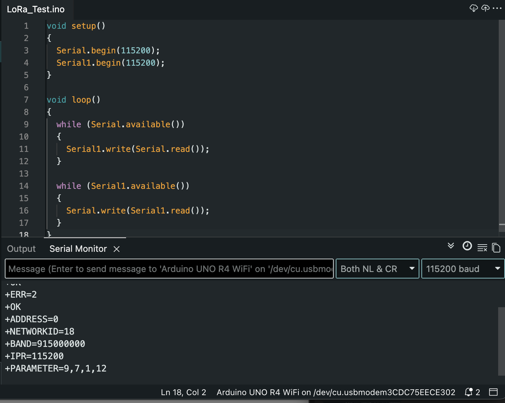

# LoRa Module Verification

## Objective

Integrate the RYLR998 LoRa module with the Arduino UNO R4 WiFi and verify UART communication using AT commands.

## Hardware

- Arduino UNO R4 WiFi

- RYLR998 LoRa Module

For complete wiring information, see the hardware documentation.

## Software

The Arduino was configured as a serial bridge between the computer and the RYLR998 module using Serial and Serial1 communication.

## Features

- UART communication with LoRa module

- AT command interface

- Address verification

- Network ID verification

- Frequency band verification

- Baud rate verification

## Example Output

+OK

+ADDRESS=0

+NETWORKID=18

+BAND=915000000

+IPR=115200

## Result

Successfully established UART communication between the Arduino UNO R4 WiFi and the RYLR998 LoRa module. Verified module configuration and confirmed operation on the 915 MHz frequency band.

## Evidence

